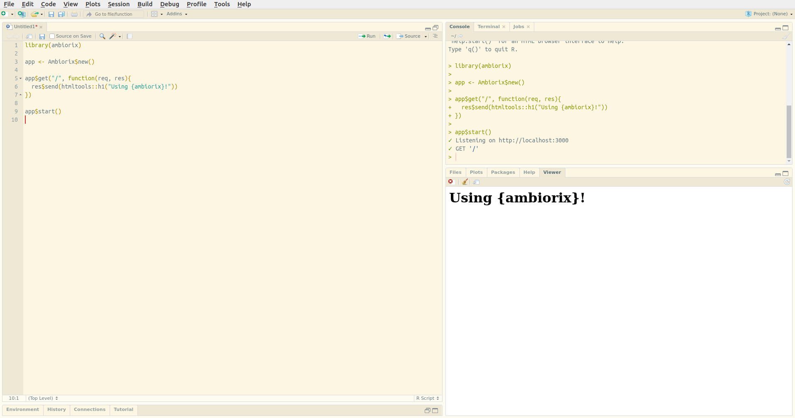

# Hello World

By default ambiorix will serve the application on a random port, this can be changed, along with other things, when instantiating the class. 

```r
library(ambiorix)

app <- Ambiorix$new()

app$get("/", \(req, res){
  res$send("Using {ambiorix}!")
})

app$get("/about", \(req, res){
  res$text("About")
})

app$start()
```



In your browser, visit `/` to see the homepage, and visit
`/about` to see the about page.

## Introduction

There is also a short video introducing the framework.

<div class="video-container">
<iframe src="https://www.youtube.com/embed/owpbIQ-j6Kk" title="YouTube video player" frameborder="0" allow="accelerometer; autoplay; clipboard-write; encrypted-media; gyroscope; picture-in-picture" allowfullscreen></iframe>
</div>
