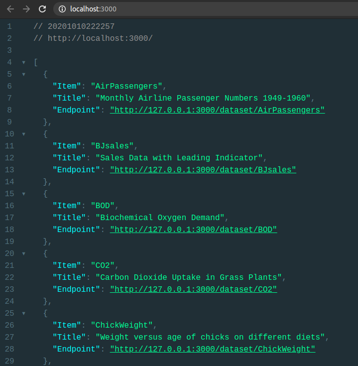

# API

One is not limited to sending HTML responses and can thus build APIs with ambiorix.

Below we build a small API that has two endpoints:

1. One that lists all the datasets in the base R `datasets` package
2. An endpoint to retrieve the datasets

```r
library(ambiorix)

PORT <- 3000L

app <- Ambiorix$new(port = PORT)

app$get("/", \(req, res){

  # get list of datasets
  datasets <- as.data.frame(data(package = "datasets")$results)
  datasets <- subset(datasets, !grepl("[[:space:]]", datasets$Item)) 

  # add links
  datasets$Endpoint <- sprintf(
    "http://127.0.0.1:%s/dataset/%s", PORT, datasets$Item
  )
  datasets$Endpoint <- sapply(datasets$Endpoint, URLencode)
  res$json(datasets[, c("Item", "Title", "Endpoint")])
})

app$get("/dataset/:set", \(req, res){
  res$json(
    get(req$params$set)
  )
})

app$start()
```



Note that you can change the serialiser with the `serialiser` method: pass it a function that accepts the data and the three-dot construct (`...`), it should return the JSON.

```r
app$serialiser(\(data, ...){
  jsonify::to_json(data, ...)
})
```
