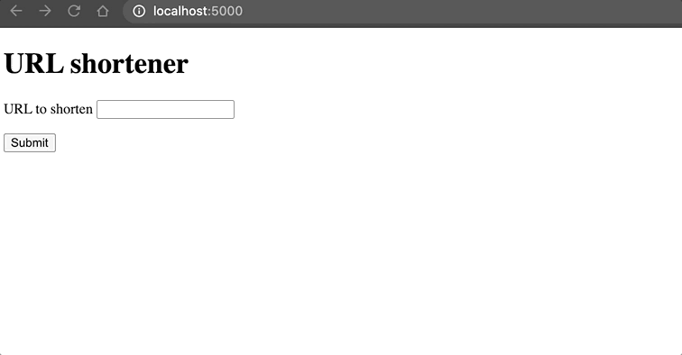

# URL Shortener

With Ambiorix we can build a URL shortener, it's nothing impressive but an interesting and fun exercise. At it's core a URL shortener accepts URLs and from it generates a shorter version. This is then stored internally so that when the generated URL is stored it simply redirects.

The project has this structure obtained from the [CLI](https://github.com/devOpifex/ambiorix-cli) with `ambiorix-cli create-basic shortener`

```
.
├── DESCRIPTION
├── app.R
├── templates
│   └── home.html
└── views
    └── base.R
```

We do a simplified version of it, without a database; everything is stored locally in an R object (so everything is lost when the server is restarted). We hard-code the port as this will be necessary in order to return the shortened URL to the user. The idea is to have a simple form on the homepage to which people can submit URLs, this is `POST`ed, the server generates and returns the short URL. Then we add a method to listen to any incoming URL and redirects. 

*Note*: We really oversimplify too much to keep this brief, there's no error checking, or anything performed.

```r
library(ambiorix)

PORT <- 5000

app <- Ambiorix$new()

# homepage
app$get("/", render_home)

app$post("/shorten/url", shorten)

# about
app$get("/:id", redirect)

# websocket 
app$receive("hello", \(msg, ws){
  print(msg)
  ws$send("hello", "Hello back! (sent from R)")
})

app$listen(PORT)
app$start()
```

The core of the app is in the `views` directory; hence it's imported above.

The homepage (`/`) is an HTML file with the form (at the bottom of this page).

The shorten function is the handler for the `POST` to `shorten/url`. This stores generates a random URL from `letters` and stores that in a local data.frame called `URLs`.

This is then used in the `redirect` method which fetches the parameter `id` and redirects accordingly.

```r
URLs <- data.frame()

# render homepage
render_home <- \(req, res){
  res$send_file("templates/home.html")
}

# render redirect
shorten <- \(req, res){  
  body <- parse_multipart(req)
  
  db <- data.frame(
    url = body$url,
    id = paste0(sample(letters, 4), collapse = "")
  )
  URLs <<- dplyr::bind_rows(URLs, db)

  url <- sprintf("http://localhost:%s/%s", PORT, db$id)
  res$send(htmltools::p("Visit:", htmltools::tags$a(href = url, url)))
}

# render redirect
redirect <- \(req, res){

  id <- req$params$id

  stored <- dplyr::filter(URLs, id == id)

  res$redirect(stored$url)
}
```

This is the homepage containing the form to submit URLs.

```html
<!DOCTYPE html>
<html lang="en">
<head>
  <title>Ambiorix</title>
</head>
<body>
  <h1>URL shortener</h1>
  <form action = "/shorten/url", enctype = "multipart/form-data", method = "POST">
    <p>
      <label for="url">URL to shorten</label>
      <input type="text" name = "url">
    </p>
    <input type="submit">
  </form>
</body>
</html>
```


